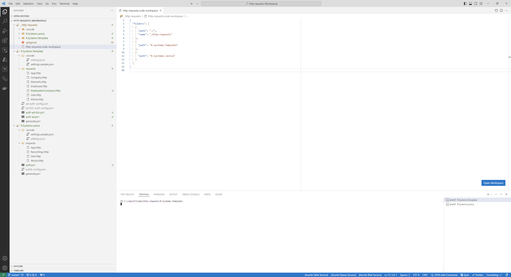
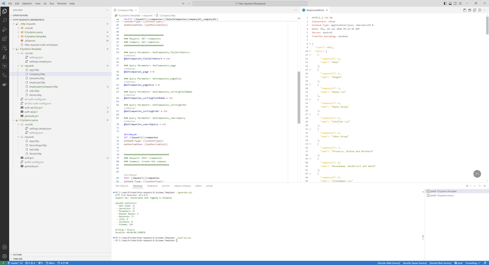

# api-authenticator

A console app generating an access token for APIs protected by OAuth 2.0 protocol.

## Why It Exists

API authenticator CLI tool helps with testing APIs that expose OpenAPI specification. The idea here is to have a tool that can do the following:

- Generate a list of executable and editable requests based on OpenAPI specification.
- Give the ability to run individual requests either from a user interface or with a command line interface.
- Give the ability to group requests per project.
- Give the ability to refresh the list of requests if OpenAPI specification is modified. Something like that can be useful when we're testing an API that we're working on, and in the result we're constantly modifying its OpenAPI specification.
- Give the ability to create own requests with different test cases, for example with different payloads.
- **Give the ability to automate (as much as possible) the process of authentication, with the assumption that most APIs are protected by OAuth 2.0 protocol.**
- Give the ability to track and save changes made in requests. In the best case scenario it should be based on GIT.
- Don't synchronize data with any third party solutions.
- Use open source solutions or alternatively solutions that are affordable for a single developer.

It's possible to fulfill these requirements by using the following combination:

- VSCode workspaces.
- REST Client extensions for VSCode - <https://marketplace.visualstudio.com/items?itemName=humao.rest-client>.
- httpgenerator .NET tool - <https://github.com/christianhelle/httpgenerator>
- api-authenticator - <https://github.com/lrydzkowski/api-authenticator>

Let's consider the following VSCode workspace:



```json
{
  "folders": [
    {
      "path": "./",
      "name": "_http-requests"
    },
    {
      "path": "R.Systems.Template"
    },
    {
      "path": "R.Systems.Lexica"
    }
  ]
}
```

It contains 2 projects with requests for my APIs:

- R.Systems.Template API - <https://github.com/lrydzkowski/R.Systems.Template>.
- R.Systems.Lexica API - <https://github.com/lrydzkowski/R.Systems.Lexica>.

In both projects there are PowerShell scripts for generating requests based on OpenAPI specification.

`R.Systems.Template/generate.ps1`:

```powershell
param(
  [string]
  $SpecUrl = "https://localhost:7040/swagger/v1/swagger.json"
)

Push-Location -Path .\requests

httpgenerator $SpecUrl `
  --no-logging `
  --authorization-header "{{bearerToken}}" `
  --base-url "{{baseUrl}}" `
  --output-type OneFilePerTag

Pop-Location
```

There are also PowerShell scripts for generating access tokens and refresh tokens that are automatically written in settings.json files.

`R.Systems.Template/auth-ad.ps1`

```powershell
param(
  [string]
  $Env = "R.Systems.Template - local"
)

api-authenticator generate-token `
  --config-file-path "./ad-auth-config.json" `
  --env $Env `
  --add-prefix-to-access-token `
  --output-file-path "./.vscode/settings.json" `
  --output-file-access-token-key "'rest-client.environmentVariables'.'{env}'.'bearerToken'" `
  --output-file-refresh-token-key "'rest-client.environmentVariables'.'{env}'.'refreshToken'" `
  --output-file-win-new-line-char
```

It writes tokens to `R.Systems.Template/.vscode/settings.json`:

```json
{
  "rest-client.environmentVariables": {
    "R.Systems.Template - local": {
      "bearerToken": "Bearer {generated_access_token}",
      "refreshToken": "{generated_refresh_token}",
      "baseUrl": "https://localhost:7040"
    },
    "R.Systems.Template - prod": {
      "bearerToken": "Bearer {generated_access_token}",
      "refreshToken": "{generated_refresh_token}",
      "baseUrl": "https://test.com/api/template"
    }
  }
}
```

After that it's possible to send requests in .http files. Example:



## How to run it

### Prerequisites

- NodeJS 20+
- PowerShell Core

### Installation

```powershell
npm install -g @lrydzkowski/api-authenticator
```

### Usage

Create a configuration file based on one of the following examples:

1. Microsoft Entra ID - authorization code flow:

   ```json
   {
     "App - local": {
       "clientId": "{client_id}",
       "scope": "openid offline_access",
       "authorizationEndpoint": "https://login.microsoftonline.com/{tenant_id}/oauth2/v2.0/authorize",
       "tokenEndpoint": "https://login.microsoftonline.com/{tenant_id}/oauth2/token",
       "flow": "authorization_code"
     }
   }
   ```

2. Microsoft Entra ID - client credentials flow:

   ```json
   {
     "App - local": {
       "clientId": "{client_id}",
       "clientSecret": "{client_secret}",
       "tokenEndpoint": "https://login.microsoftonline.com/{tenant_id}/oauth2/token",
       "resource": "{resource_id}",
       "flow": "client_credentials"
     }
   }
   ```

3. Azure AD B2C - authorization code flow:

   ```json
   {
     "App - local": {
       "clientId": "{client_id}",
       "redirectUri": "{redirect_uri}",
       "scope": "openid offline_access",
       "authorizationEndpoint": "https://{tenant_name}.b2clogin.com/{tenant_name}.onmicrosoft.com/B2C_1_SIGN_UP_SIGN_IN/oauth2/v2.0/authorize",
       "tokenEndpoint": "https://{tenant_name}.b2clogin.com/{tenant_name}.onmicrosoft.com/B2C_1_SIGN_UP_SIGN_IN/oauth2/v2.0/token",
       "flow": "authorization_code"
     }
   }
   ```

4. Auth0 - authorization code flow:

   ```json
   {
     "App - local": {
       "clientId": "{client_id}",
       "redirectUri": "{redirect_uri}",
       "scope": "openid offline_access profile",
       "authorizationEndpoint": "https://{tenant_name}.eu.auth0.com/authorize",
       "tokenEndpoint": "https://{tenant_name}.eu.auth0.com/oauth/token",
       "audience": "{audience}",
       "flow": "authorization_code"
     }
   }
   ```

Run the following command in PowerShell Core:

```powershell
api-authenticator generate-token `
  --config-file-path "{config_file_path}" `
  --env "App - local" `
  --add-prefix-to-access-token
```

It's also possible to write a generated access token to an output JSON file. Let's create an example output file:

```json
{
  "rest-client.environmentVariables": {
    "App - local": {
      "bearerToken": "",
      "refreshToken": "",
      "baseUrl": "https://localhost:7040"
    },
    "App - dev": {
      "bearerToken": "",
      "refreshToken": "",
      "baseUrl": "https://localhost:7041"
    }
  }
}
```

and run the following command:

```powershell
api-authenticator generate-token `
  --config-file-path "{config_file_path}" `
  --env "App - local" `
  --add-prefix-to-access-token `
  --output-file-path "{output_file_path}" `
  --output-file-access-token-key "'rest-client.environmentVariables'.'{env}'.'bearerToken'" `
  --output-file-refresh-token-key "'rest-client.environmentVariables'.'{env}'.'refreshToken'" `
  --output-file-win-new-line-char
```

## Technical Details

1. It's written in TypeScript.
2. The process of getting tokens is based on:
   1. oauth4webapi library - <https://github.com/panva/oauth4webapi>.
   2. Puppeteer library - <https://pptr.dev/>

## Known Limitations

1. OAuth 2.0 protocol support is based on my specific needs and it's not a comprehensive implementation regarding different possible configurations of this protocol.
